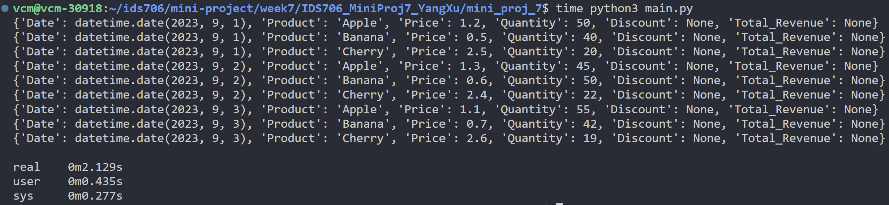
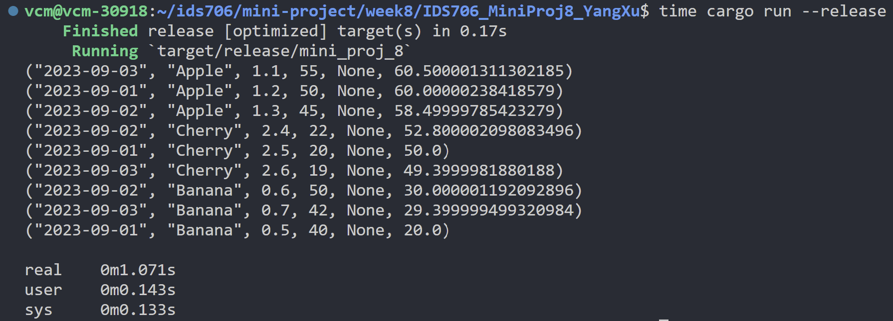
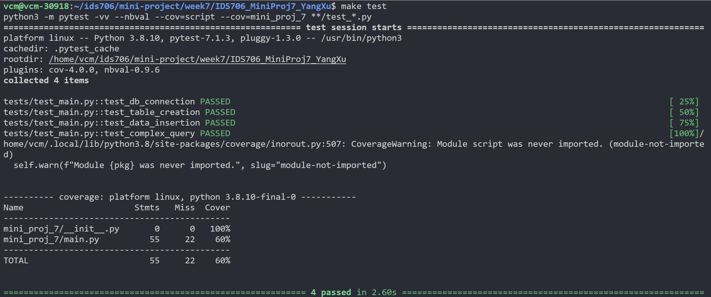

# IDS706_MiniProj8_YangXu

Rust version:[This Repositories](https://github.com/nogibjj/IDS706_MiniProj8_YangXu)<br>
[](https://github.com/nogibjj/IDS706_MiniProj8_YangXu/actions/workflows/cicd.yml)


Python version:[IDS706_MiniProj7_YangXu](https://github.com/nogibjj/IDS706_MiniProj7_YangXu)<br>
[](https://github.com/nogibjj/IDS706_MiniProj7_YangXu/actions/workflows/cicd.yml)

## Project Overview

This project rewrites a previous Python script ([IDS706_MiniProj7_YangXu](https://github.com/nogibjj/IDS706_MiniProj7_YangXu)) into Rust, showcasing complex SQL queries using an external MySQL database. The goal is to demonstrate proficiency in constructing SQL queries in Rust and to highlight performance improvements over the Python counterpart. This Rust application also integrates Continuous Integration (CI) for automated testing.

## Table of Contents

- [Project Structure](#project-structure)
- [Requirements](#requirements)
- [Installation](#installation)
- [Usage](#usage)
- [Running Tests](#running-tests)
- [Performance Comparison](#performance-comparison)
- [Acknowledgements](#acknowledgements)

## Project Structure

```bash
IDS706_MiniProj8_YangXu (Root Directory)
│
├── .devcontainer
│   ├── Dockerfile
│   └── devcontainer.json
│
├── .github
│   └── workflows
│       └── cicd.yml
│
├── mini_proj_8
│   ├── config.rs
│   ├── main.rs
│   ├── lib.rs
│   └── dataset_sample.csv
│
├── tests
│   └── test_main.rs
│   └── dataset_sample.csv
│
├── dataset_sample.csv
│
├── Cargo.toml
│
├── .env
│
├── env.example
│
├── requirements.txt
│
├── Makefile
│
├── README.md
│
└── .gitignore
```

## Requirements

The Rust project leverages several crates:

- csv: To handle CSV data.
- mysql_async: For asynchronous database operations.
- tokio: An asynchronous runtime.
- dotenv: To manage environment variables.
- futures: For future combinators.

## Installation

1. Clone this repository.
2. Create a .env file using env.example as a template. Fill in your database credentials.
3. Build the project using Cargo:
    ```bash
    cargo build --release
    ```

## Usage

After building, you can run the program using:
    ```bash
    cargo run --release
    ```

## Running Tests

To run the tests for the project, use:
    ```bash
    cargo test
    ```

## Complex Query Explanation

The complex SQL query used in this project performs the following operations:

1. Joins the main data table (`week6_mini`) with the discounts table (`week6_mini_discounts`) using the "Product" column.
2. Calculates the total revenue by multiplying price and quantity, considering any available discount.
3. Sorts the results by the calculated total revenue in descending order.

    ```sql
    SELECT w.Date, w.Product, w.Price, w.Quantity, d.Discount,
        (w.Price * w.Quantity) * (1 - d.Discount) AS Total_Revenue
    FROM week6_mini w
    LEFT JOIN week6_mini_discounts d ON w.Product = d.Product
    ORDER BY Total_Revenue DESC;
    ```

## Sample Output

- **Descriptive Statistics**:

    ```bash
    ("2023-09-03", "Apple", 1.1, 55, None, 60.500001311302185)
    ("2023-09-01", "Apple", 1.2, 50, None, 60.00000238418579)
    ("2023-09-02", "Apple", 1.3, 45, None, 58.49999785423279)
    ("2023-09-02", "Cherry", 2.4, 22, None, 52.800002098083496)
    ("2023-09-01", "Cherry", 2.5, 20, None, 50.0)
    ("2023-09-03", "Cherry", 2.6, 19, None, 49.3999981880188)
    ("2023-09-02", "Banana", 0.6, 50, None, 30.000001192092896)
    ("2023-09-03", "Banana", 0.7, 42, None, 29.399999499320984)
    ("2023-09-01", "Banana", 0.5, 40, None, 20.0)
    ```

## Performance Comparison

The performance improvements of the Rust project over the Python counterpart can be determined through several methods:

1. **Time Execution**: Measure the time it takes for both the Python and Rust projects to execute.
2. **Memory Usage**: Measure the RAM usage of both the Python and Rust projects during execution.


## Acknowledgements

This Rust project is a rewrite of the Python project, [IDS706_MiniProj7_YangXu](https://github.com/nogibjj/IDS706_MiniProj7_YangXu). The aim is to enhance speed and resource efficiency.

1. **Time Execution**: Can use the `time` command in Linux to measure the time it takes for both scripts to execute.

    **For Python**:
    ```bash
    time python3 mini_proj_7/mian.py
    ```
    

    **For Rust**:
    ```bash
    time cargo run --release
    ```
    

    ### Comparison of Execution Times:
    **Python Version**: `Took approximately 2.129 seconds for execution.`
    **Rust Version**: `Took approximately 1.071 seconds for execution.`
    ### Runtime Result:
    `The Rust version executed almost twice as fast, showing a significant improvement in performance over the Python version.`
    <br>


    ### Python version test result:
    


2. **Memory Usage**: Can use the memory-profiler package in Python and the heaptrack tool for Rust.

    **For Python**:
    ```bash
    mprof run mini_proj_7/mian.py
    mprof plot
    ```

    **For Rust**:
    ```bash
    heaptrack cargo run --release
    heaptrack_gui heaptrack.week8mini.12345.gz
    ```

    ### Memory Allocation Data:

    **Python Version**:
    ```bash
    data:
            CMDLINE /usr/bin/python3 main.py
            MEM 3.578125 1698031577.0329
            MEM 19.996094 1698031577.1332
            MEM 30.339844 1698031577.2336
            MEM 38.542969 1698031577.3340
            MEM 48.914062 1698031577.4343
            MEM 66.542969 1698031577.5346
            MEM 80.039062 1698031577.6350
            MEM 84.335938 1698031577.7354
            MEM 84.351562 1698031577.8358
            MEM 84.351562 1698031577.9362
            MEM 85.007812 1698031578.0367
            MEM 85.007812 1698031578.1370
            MEM 85.007812 1698031578.2377
            MEM 85.007812 1698031578.3382
            MEM 85.761719 1698031578.4387
    ```

    The Python version starts with a memory usage of approximately 3.58 MiB. There's a notable rise in memory consumption within the initial moments, reaching close to 20 MiB quickly. The memory usage then continues to rise more steadily, peaking around 84.35 MiB. After reaching this peak, the memory consumption becomes relatively stable with minor fluctuations, eventually settling around 85.76 MiB by the end of the captured data. This suggests that the bulk of memory allocations happen during the initial phase of the program's execution, after which the memory usage stabilizes.<br>

    **Rust Version**:
    ```bash
    data:
            total runtime: 0.22s.
            bytes allocated in total (ignoring deallocations): 22.96MB (104.34MB/s)
            calls to allocation functions: 148589 (675404/s)
            temporary memory allocations: 55913 (254150/s)
            peak heap memory consumption: 8.65MB
            peak RSS (including heaptrack overhead): 84.42MB
            total memory leaked: 652.18KB
    ```

    During the execution of our Rust program, heaptrack profiling indicated a peak heap memory consumption of 8.65MB, with an overall memory allocation of 22.96MB. Most notable was the high frequency of allocation calls, particularly linked to string operations within the Cargo binary, totaling 148,589 calls within a mere 0.22 seconds runtime. Despite this extensive memory activity, a potential area of concern emerged with a detected memory leak of 652.18KB. This emphasizes the importance of rigorous memory management when considering longer or more frequent executions.<br>

    ### Memory Result:
    Comparing both versions, while the Python script had a gradually increasing memory profile, the Rust version showed a more rapid memory allocation but a slightly lower peak consumption. However, the detected memory leak in the Rust version underscores the need for careful memory management.
